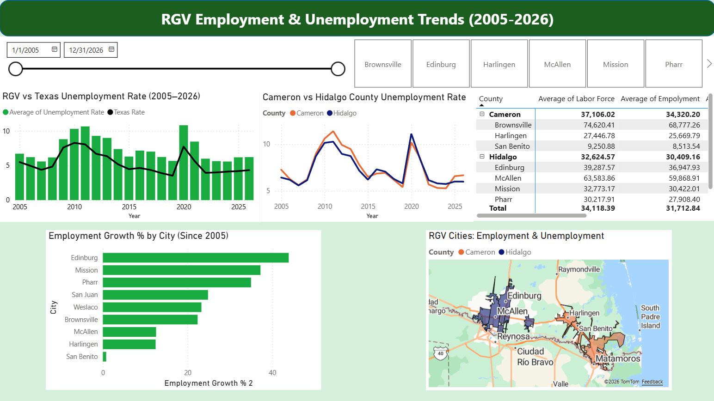

# RGV Employment & Unemployment Analysis (2005-2026)

An interactive Power BI data analytics case study examining long-term labor market trends, municipal growth disparities, and economic vulnerability across the Rio Grande Valley (Cameron and Hidalgo counties) relative to the Texas state average.

## Dashboard Preview

## Analytical Question & Business Problem
* **Core Question:** Does the Rio Grande Valley have a higher unemployment rate than Texas's average, and which cities are driving or lagging behind the region's growth?
* **The Problem:** Despite steady economic progress over two decades, the RGV faces an uneven growth distribution among its cities and exhibits extreme vulnerability to macro-economic downturns, recovering much slower than the rest of the state.

## High-Impact Key Metrics
* **7.37%** – RGV Average Unemployment Rate (2005–2026)
* **5.50%** – Texas Statewide Average Unemployment Rate
* **~2.00%** – Persistent structural unemployment gap between RGV and Texas
* **11.00%+** – Peak regional unemployment reached during the 2010 and 2020 recessions

## Key Data Insights & Findings
* **The Structural Gap:** RGV unemployment systematically runs 2–4% higher than the Texas statewide average every year, even during peak economic booms.
* **Uneven Municipal Growth:** Growth is highly localized. **Edinburg** is a major economic engine, surging with **43.91% employment growth**, followed closely by San Juan (24.84%) and Brownsville (22.39%).
* **Regional Stagnation:** **San Benito** has critically lagged behind, recording just **0.78% employment growth** over a 20-year period, paired with a small average employment footprint of 8,514.
* **High-Risk Zones:** **San Juan** exhibits the highest city-level unemployment rate at **8.79%**, highlighting localized labor market distress despite decent overall growth.
* **Recession Amplification:** The RGV economy amplifies national economic shocks (2008 financial crisis and COVID-19), with downturns hitting 30–50% harder and lasting longer than the Texas baseline.

## Actionable Recommendations
1. **Target Workforce Development:** Focus immediate local business incentives and upskilling programs directly within lowest-growth, highest-unemployment areas (**San Benito & San Juan**).
2. **Replicate Edinburg's Playbook:** Conduct a structural economic study on Edinburg's **43.91% growth** model to identify policies, infrastructure investments, or business factors that can be scaled to neighboring municipalities.
3. **Build Economic Resiliency Buffers:** Advise regional planning committees to establish localized economic shock absorbers to mitigate the historical 30–50% downturn amplification pattern.
